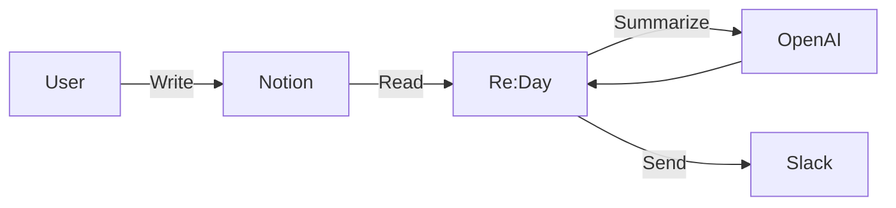
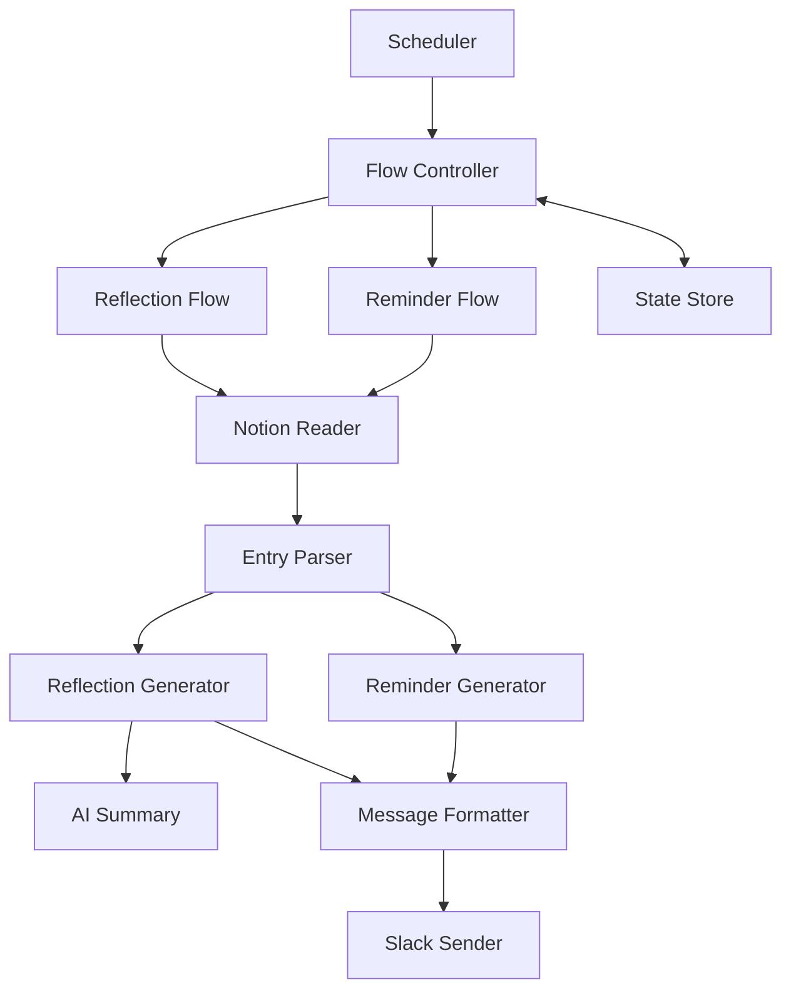
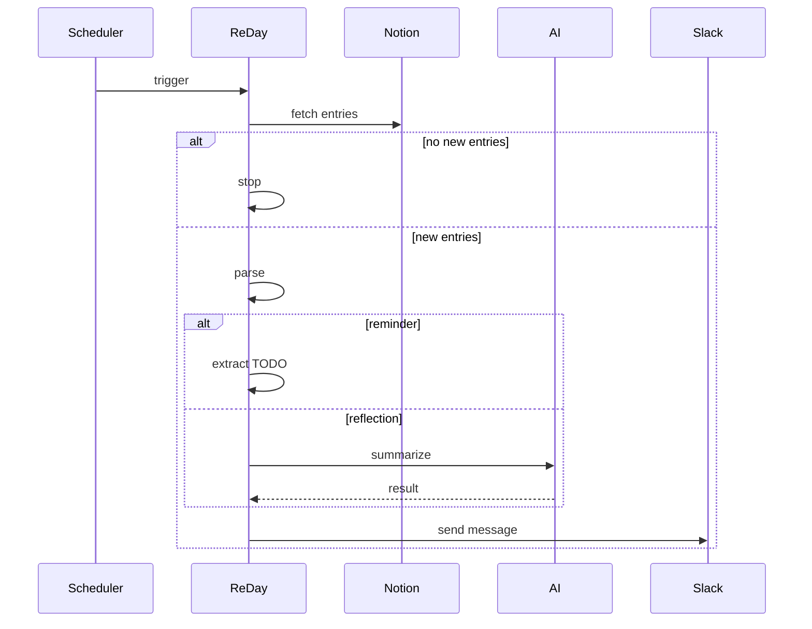

# Re:Day

> 기록을 다시 보여줘서 행동을 이어지게 만드는 개인 루프 시스템

---

## ✨ Overview

Re:Day는 **Notion에 기록한 일지를 기반으로**

* 최근 흐름을 다시 인식하고
* 이어서 할 행동을 자연스럽게 떠올리게 만드는

**개인 리마인드 + 회고 자동화 시스템**입니다.

---

## 🧠 Core Concept

```
기록 → 회고 → 행동
```

* **기록**: 하루를 간단히 남김
* **회고**: 최근 흐름을 다시 마주침
* **행동**: 다음 행동을 이어서 시작

---

## 🚀 Features

### 1️⃣ Reminder (행동 트리거)

* 평일 저녁 Slack 메시지 전송
* 최근 기록에서 TODO 추출
* AI 사용 없음 (빠르고 안정적)

```
Re:Day

오늘 이어서 할 수 있는 것
• CodeTune TODO 정리
• 책 10페이지 읽기
```

---

### 2️⃣ Reflection (상태 인식)

* 주 2회 (월 / 목)
* 최근 기록을 묶어서 요약

```
🌿 Re:Day

요즘 흐름
- 운동은 꾸준히 이어지고 있음
- CodeTune은 간헐적으로 진행됨

행동 기록
- 운동 3회
- CodeTune 2회
```

---

### 3️⃣ Smart Delivery

* **새로운 기록이 있을 때만 전송**
* 불필요한 알림 제거
* 의미 있는 메시지만 전달

---

## 🏗 Architecture

### System Overview



---

### Internal Structure



---

### Flow Logic



---

## ⚙️ Tech Stack

* **Runtime**: Node.js
* **API**

  * Notion API
  * Slack API
  * OpenAI API (reflection only)
* **Infra**

  * GitHub Actions (scheduler)

---

## 🔑 Environment Variables

```env
NOTION_API_KEY=
NOTION_DATABASE_ID=

OPENAI_API_KEY=
OPENAI_MODEL=

SLACK_BOT_TOKEN=
SLACK_REMINDER_CHANNEL=
SLACK_REFLECTION_CHANNEL=
```

---

## 🛠 How It Works

1. Scheduler runs (GitHub Actions or manual)
2. Fetch recent entries from Notion
3. Check if new entries exist
4. Generate message

   * Reminder → TODO 기반
   * Reflection → AI 요약
5. Send message to Slack
6. Update state

---

## 📦 MVP Scope

* [x] Notion 일지 조회
* [x] TODO 리마인드 전송
* [x] 주 2회 회고 메시지

---

## 🔮 Future Plans

* Pattern analysis (행동 흐름)
* Keyword frequency tracking
* Insight messages
* Slack assistant (CLI-style interaction)

---

## 💡 Design Philosophy

### 1. Action-driven

단순 기록이 아니라 **행동을 이어주는 시스템**

### 2. Minimal AI

AI는 보조 역할
→ 없어도 시스템 동작 가능

### 3. Signal over Noise

의미 있는 메시지만 전달
